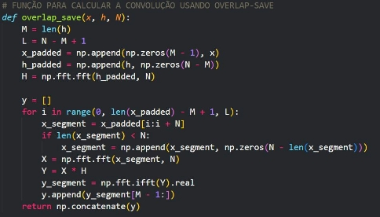
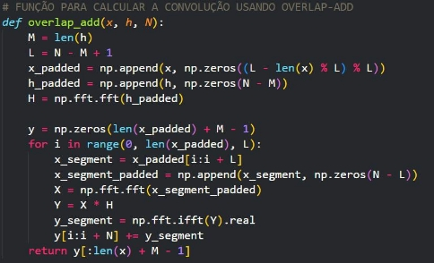
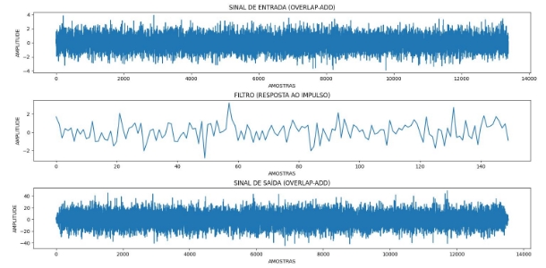
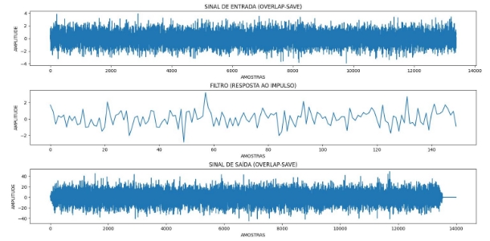
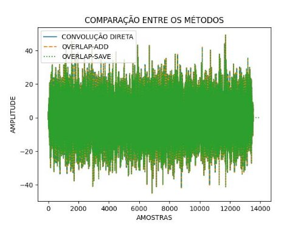
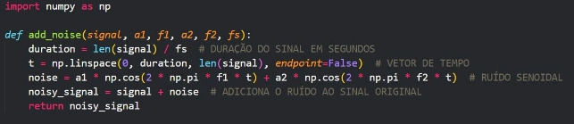
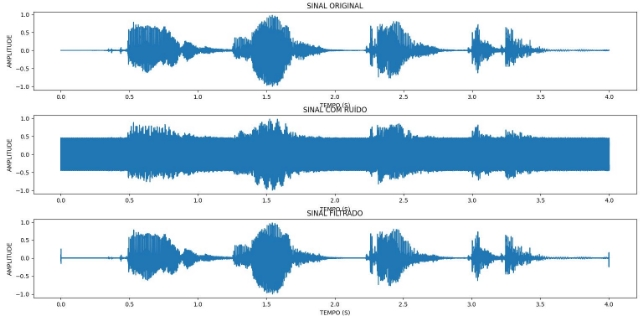



  

 

<strong>UNIVERSIDADE FEDERAL DO RIO GRANDE DO NORTE</strong>

 
DEPARTAMENTO DE ENGENHARIA DE COMPUTAÇÃO E AUTOMAÇÃO  
DCA3602 - PROCESSAMENTO DIGITAL DE SINAIS

<h2 align="center"><strong>SIMULAÇÃO COMPUTACIONAL V</strong></h2>

DISCENTE: MINNAEL CAMPELO DE OLIVEIRA  
ROBSON TERTULIANO DA SILVEIRA  

DOCENTE: LUIZ FELIPE DE QUEIROZ SILVEIRA  

NATAL/RN 2025  

---

### **1. PROBLEMÁTICA**

Tanto o Passo 1 quanto o Passo 2 descrevem etapas importantes no desenvolvimento e validação de algoritmos de convolução aplicados ao processamento de sinais, com foco em métodos eficientes como overlap-save e overlap-add. Essas técnicas são amplamente utilizadas para otimizar a implementação de filtros lineares em sinais de longa duração, especialmente em contextos onde a eficiência computacional é essencial, como o processamento em tempo real.

O experimento como um todo reflete conceitos fundamentais do processamento digital de sinais, como a convolução e a Transformada Rápida de Fourier (FFT), que são pilares de áreas como telecomunicações, processamento de áudio e sistemas embarcados. Ao integrar teoria e prática, o projeto prepara os participantes para lidar com desafios técnicos em ambientes industriais e de pesquisa, promovendo o desenvolvimento de soluções eficientes e aplicáveis em cenários reais.

---

### **2. DESENVOLVIMENTO**

Para o desenvolvimento tanto do Passo 1 quanto do Passo 2 descritos na documentação base da simulação computacional 5, foi utilizada a linguagem de programação Python. Para a facilitação da implementação e manutenção do projeto, foram empregadas as seguintes bibliotecas:

- **numpy**: para cálculos computacionais simples e complexos.  
- **matplotlib**: para modelar e simular gráficos.  
- **scipy**: para manipulação e modelagem de áudio.  

O projeto foi organizado em diferentes arquivos para maior flexibilidade.

#### **2.1 PASSO 1**

O arquivo **functions_convolve.py** é responsável por definir as funções **overlap_save** e **overlap_add**:

  

  

**Figura 01** - Funções de Overlap-add e Overlap-save.  

Essas funções implementam dois métodos eficientes de convolução para sinais longos usando a Transformada Rápida de Fourier (FFT). Ambos métodos são úteis em aplicações onde o comprimento do sinal de entrada é maior que o do filtro, como em telecomunicações e processamento de áudio.

Os sinais e gráficos obtidos pelos métodos estão representados abaixo:

  

**Figura 02** - Sinais definidos em Overlap-add.  

  

**Figura 03** - Sinais definidos em Overlap-save.  

O comparativo entre os métodos de convolução resultou no gráfico seguinte:

  

**Figura 04** - Comparativo de ambas as funções.

---

#### **2.2 PASSO 2**

Para a modelagem do ruído no Passo 2, foi criada a função de ruído, baseada em simulações computacionais anteriores:

  

**Figura 05** - Função que modela o ruído.  

O sinal de áudio foi carregado, normalizado (via **scipy**), e combinado com os parâmetros do ruído. Após a filtragem com o método **overlap-add**, os resultados foram convertidos para áudio.

Os gráficos comparativos entre entrada, filtro e saída estão dispostos abaixo:

  

**Figura 06** - Comparativo de entrada, filtro e saída.  

  

**Figura 07** - Comparativo de áudios após processo de filtragem.  

---

### **4. CONCLUSÃO**

O trabalho foi realizado com excelência, obtendo resultados satisfatórios e alinhados com a literatura e os estudos realizados em sala de aula. Seguindo rigorosamente as instruções do arquivo base da simulação computacional 5, foi possível demonstrar a importância de técnicas avançadas no processamento digital de sinais.  

A avaliação individual desta atividade destacou sua relevância para o aprofundamento nos conceitos da disciplina, preparando os participantes para resolver desafios técnicos reais em ambientes industriais e de pesquisa.  

Para mais detalhes sobre a implementação, visite o repositório no [GITHUB](https://github.com/Minnael/SIMULACAO-DFT-PDS).
