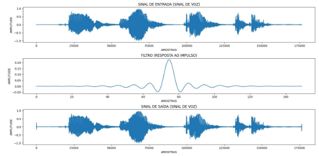

UNIVERSIDADE FEDERAL DO RIO GRANDE DO NORTE
DEPARTAMENTO DE ENGENHARIA DE COMPUTAÇÃO E AUTOMAÇÃO DCA3602 - PROCESSAMENTO DIGITAL DE SINAIS

**SIMULAÇÃO COMPUTACIONAL V**

DISCENTE: MINNAEL CAMPELO DE OLIVEIRA ROBSON TERTULIANO DA SILVEIRA

DOCENTE: LUIZ FELIPE DE QUEIROZ SILVEIRA

NATAL/RN 2025

1. **PROBLEMÁTICA**

Tanto o Passo 1 quanto o Passo 2 descrevem etapas importantes no desenvolvimento e validação de algoritmos de convolução aplicados ao processamento de sinais, com foco em métodos eficientes como overlap-save e overlap-add. Essas técnicas são amplamente utilizadas para otimizar a implementação de filtros lineares em sinais de longa duração, especialmente em contextos onde a eficiência computacional é essencial, como o processamento em tempo real.

O experimento como um todo reflete conceitos fundamentais do processamento digital de sinais, como a convolução e a Transformada Rápida de Fourier (FFT), que são pilares de áreas como telecomunicações, processamento de áudio e sistemas embarcados. Ao integrar teoria e prática, o projeto prepara os participantes para lidar com desafios técnicos em ambientes industriais e de pesquisa, promovendo o desenvolvimento de soluções eficientes e aplicáveis em cenários reais.

1. **CONTEXTUALIZAÇÃO DO PASSO 1**

O objetivo principal é implementar o algoritmo de convolução escolhido e validá-lo com sinais aleatórios. Utilizam-se sinais de entrada x[n] e filtros FIR h[n], gerados com parâmetros específicos para permitir a comparação com os resultados obtidos por métodos convencionais de convolução no domínio do tempo. O comprimento do sinal de entrada é definido como um múltiplo de LLL, relacionado ao tamanho da FFT utilizada, reforçando a aplicação de conceitos fundamentais do processamento digital de sinais, como a relação entre o tempo e a frequência. Essa etapa é crucial para garantir que o algoritmo implementado funcione corretamente e que seja capaz de substituir métodos tradicionais com a mesma precisão, mas com maior eficiência. A validação do método desenvolvido é essencial para demonstrar sua robustez e confiabilidade em condições controladas.

2. **CONTEXTUALIZAÇÃO DO PASSO 2**

A aplicação do método validado avança para um contexto mais próximo de situações reais: a filtragem de sinais de voz. Essa etapa utiliza um sinal de voz com duração mínima de 10 segundos, o que impõe desafios adicionais, como o gerenciamento de grandes volumes de dados e a manutenção da integridade do sinal processado. Além disso, o filtro FIR projetado no passo anterior é reaproveitado para essa aplicação, o que reflete uma abordagem prática e integrada de desenvolvimento. A utilização de métodos customizados em substituição a funções padrão, como filter ou conv do MATLAB, ressalta a importância de compreender os fundamentos do algoritmo e sua implementação. Essa prática capacita os desenvolvedores a adaptar soluções específicas para requisitos técnicos e limitações de sistemas reais.

2. **DESENVOLVIMENTO**

Para o desenvolvimento tanto do Passo 1 quanto do Passo 2 descritos na documentação base da simulação computacional 5 foi utilizado a linguagem de programação python. Para a facilitação da implementação e manutenção do projeto foi necessário utilizar as seguintes bibliotecas: numpy, matplotlib e scipy que foram respectivamente utilizadas para, fazer cálculos computacionais simples e complexos, modelar e simular gráficos, modelar áudios. Vale salientar que para melhor flexibilização do projeto foi necessário dividir o mesmo em arquivos diferentes.

**2.1 PASSO 1**

Segue abaixo o arquivo **functions\_convolve.py** responsável por definir as funções de **overlap\_save** e **overlap add**:

Figura 01 - Funções de Overlap-add e Overlap-save.

Os códigos apresentados implementam dois métodos eficientes de convolução para sinais

longos usando a Transformada Rápida de Fourier (FFT). Ambos são utilizados para calcular a convolução linear entre um sinal de entrada x[n] e a resposta ao impulso de um filtro h[n]. Esses métodos são especialmente úteis em aplicações onde o comprimento do sinal de entrada é significativamente maior do que o do filtro, como no processamento de áudio, telecomunicações e outros sistemas digitais.

Sabendo das instruções gerais definidas no arquivo da simulação computacional 5 foi definido o número de pontos na fft como 1024, o número de amostras para de 150 e um comprimento do sinal de entrada de 15,3L. Tomando como base e levando em consideração que L = N (números de pontos da fft) - M (número de amostras) + 1 foi possível definir o sinal de entrada x[n] e o filtro FIR h[n].

Após ambos estarem definidos, foram passados como parâmetros das funções overlap-save e overlap-add em conjunto com o número de pontos da fft. Onde os gráficos pertencentes a ambas funções podem ser visualizados abaixo:

Figura 02 -Sinais definidos em overlap-add.

Figura 03 -Sinais definidos em overlap-add.

Levando em consideração os gráficos acima foi desenvolvido um pequeno algoritmo que fizesse um comparativo base dos dois métodos de convolução e o mesmo definiu o seguinte gráfico:

Figura 04 - Comparativo de ambas as funções.

Analisando o gráfico gerado podemos chegar a conclusão que a convolução direta, o método mais intuitivo, realiza a operação no domínio do tempo sem segmentar o sinal, sendo geralmente mais lenta para sinais longos devido à alta complexidade computacional. Em contraste, os métodos Overlap-Add e Overlap-Save utilizam técnicas segmentadas para melhorar a eficiência. O Overlap-Add divide o sinal em blocos menores, realiza a convolução em cada segmento separadamente e combina os resultados finais, garantindo a continuidade do sinal processado. Já o Overlap-Save também trabalha com blocos, mas utiliza janelas sobrepostas e descarta as bordas indesejadas, preservando apenas as porções úteis de cada operação. Apesar das diferenças em abordagem, os três métodos produzem resultados equivalentes em termos de precisão do sinal convoluído, sendo as vantagens dos métodos segmentados mais evidentes em cenários onde o desempenho computacional é crítico.

**2.1 PASSO 2**

Para o desenvolvimento do Passo 2 foi necessário criar uma função ruído que por sua vez foi baseada na função ruído das simulações computacionais anteriores. Segue abaixo o algoritmo/função:

Figura 05 - Função que modela o ruído.

Para tal, os parâmetros que foram passados foi o sinal de áudio que foi carregado e normalizado a fim de evitar possíveis saturações (via scipy), bem como a1 = 0.5, a2 = 0.3, f1 = 5500, f2 =5800. Após o retorno da função o áudio foi salvo em .wav para puder ser executado e avaliado posteriormente.

Por fim foi gerado um filtro FIR baseado na janela blackman (que foi a melhor encontrada após testes empíricos). Com base no filtro FIR h[n] e no sinal de áudio com ruído x[n] foi realizada uma filtragem por meio de OVERLAP-ADD resultado em um sinal que posteriormente foi passado para áudio.

Segue abaixo o gráfico do sinal de voz entrada, a representação do funcionamento do filtro e o sinal de voz na saída:

Figura 06 - Comparativo de entrada, filtro e saída.

Segue abaixo o gráfico comparativo do sinal original, sinal com ruído e sinal filtrado:

Figura 07 - Comparativo de áudios após processo de filtragem.

**Tomando como base a divisão da atividade por meio de passos, o relatório também será fundamentado através de relatos relacionados ao Passo 1 e Passo 2.**

**No seguinte relatório não serão definidas muitas imagens de código e lógica de programação no geral, para mais informações sobre a implementação basta ir para o [GITHUB](https://github.com/Minnael/SIMULACAO-DFT-PDS).**

**4. CONCLUSÃO**

O trabalho foi realizado com excelência e conseguiu obter resultados satisfatórios e esperados pela literatura e pelos os estudos de sala de aula tendo em vista que o do algoritmo seguiu todas as regras descritas no princípio de funcionamento definido no arquivo base da simulação computacional 5. A nível de avaliação individual (dupla) do trabalho é possível definir como uma tarefa extremamente importante no que tange aos conhecimentos descritos na disciplina de processamento digital de sinais.
